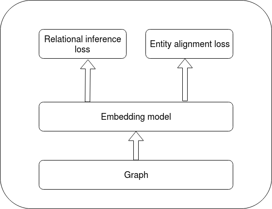
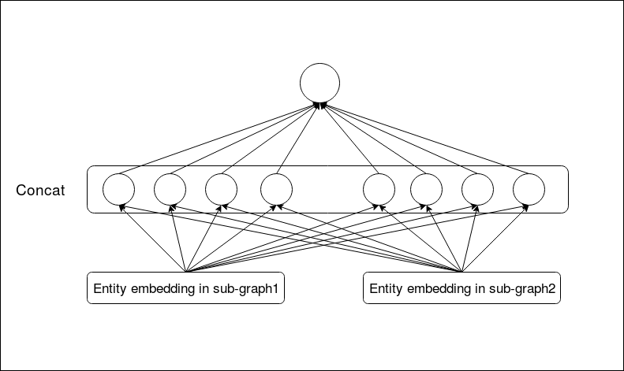
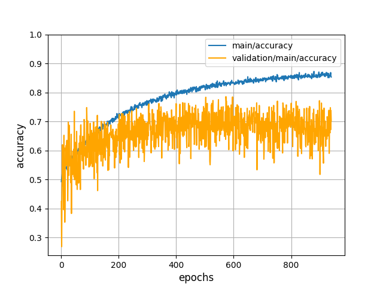

### Entity Alignment in Knowledge Base

ZHAO XIN

2018-10-24

---

### Catalog

- Motivation
- Related Works
- Tasks & Methods
  - Dataset Collection
  - Graph Sampling
  - Knowledge Base Integration
- Future work

---

### 1. Motivation

- 1.1 Cross-Graph relational inference

  - **Multi-source learning** is important for **relational inference**.
  - For example : **Heterogeneous knowledge graph** of (author, paper, keyword)
  - Useful for **recommender systems and question-answering** etc.

>>>

- 1.2 Cross-lingual Knowledge Alignment

  - Cross-lingual knowledge is essential for **Cross-language AI-related applications**
  - For example : **Semantic Web**, **question answering** and **Machine translation**. 
  <!-- - Low coverage : Entity alignment database is still small -->
  - Multi-linguality gap : Multilingual knowledge bases is unbalanced between languages. 

>>>

- 1.3 Knowledge base Enhance

  - Use one knowledge base to **enhance** another one.
  - For example :
    - Freebase is a stop-updating database. But DBpedia is still updating. 
    - Entity alignment dataset is exist
    - It is possible to use DBpedia to enhance freebase

---

### 2. Related Work

- Compositional Models 
- Translational Models

>>>

#### 2.1 Direct Alignment Models

- Factorization of adjacency matrices

- $\min_P||PAP^T-B||^2_F$ 

>>>

#### 2.2 Embedding Models

- Model overview

>>>

##### 1) About embedding model 

- Directly mapping model
  - $\mathbb{e}_i =E \cdot e_i$

- Context-based embedding
  - Graph convolution embedding
  - Use of attribution information 

>>>

##### 1) About loss function 

- Loss function have two parts:
  - Relation inference loss
  - Entity alignment loss
    - Translation-based Model

>>>

- Relation inference loss
    - Transition-based method
      - $\min\sum_i||h_i+r_i-t_i||$
    - Matrix Factorization
      - $\min\sum_ih_i^Tr_i t_i$

>>>

- Entity alignment loss
  - Translation-based Model
    - $\min\sum_k ||e_k^1+r^{(E_1\to E_2)}-e_k^2||$
  - Linear Transformation Model
    - $\min\sum_k ||M^{(E_1\to E_2)}e_k^1-e_k^2||$
  - Parameter Sharing Model
    - $\min\sum_k ||e_k^1-e_k^2||$

---

### 2.2.1 Entity alignment model 

- 

>>> 

### 2. Task & Method

- **Task Definition**
- Dataset Collection
- Graph Sampling
- Knowledge Base Integration

---

### 2.1 Task Definition

- **Task Definition**
  - Dataset Definition
  - Problem Definition

>>>

##### 2.1.1 Dataset Definition

- Condition : Two knowledge graphs -> sub-graph
- Goal : Integration knowledge graphs -> complete graph

>>>

- Entity set:

  $$\mathcal{E}=\mathcal{E}_1\cup\mathcal{E}_2\cup\mathcal{E}_s$$

- Sub-graph1:

  $$\mathcal{G1} : \{(e_i^{h1},r_i^1,e_i^{t1})|e_i^{h1},e_i^{t1}\in\mathcal{E_1}\cup\mathcal{E}_s, r_i^1\in\mathcal{R_1}}$$

- Sub-graph2:

  $$\mathcal{G2} : \{(e_i^{h2},r_i^2,e_i^{t2})|e_i^{h2},e_i^{t2}\in\mathcal{E_2}\cup\mathcal{E}_s, r_i^2\in\mathcal{R_2}}$$

- Complete Graph:

  $$\mathcal{G} : \{(e_i^h,r_i,e_i^t)|e_i^h,e_i^t\in\mathcal{E}, r_i\in\mathcal{R}\}$$

>>>

Venn graph

  

>>>

##### 2.1.2 Problem Definition

- Train/Test Division:

  $$\mathcal{E}_1=\mathcal{E}_1^{train}\cup\mathcal{E}_1^{test}$$

  $$\mathcal{E}_2=\mathcal{E}_2^{train}\cup\mathcal{E}_2^{test}$$

  $$\mathcal{E}_s=\mathcal{E}_s^{train}\cup\mathcal{E}_s^{test}$$

- Problem setting

  - $\mathcal{E}_1^{train}, \mathcal{E}_2^{train}, \mathcal{E}_s^{train}$ And
    $\mathcal{E}_1^{test}\cup\mathcal{E}_s^{test},\mathcal{E}_2^{test}\cup\mathcal{E}_s^{test}$ is known
  - $\mathcal{G1}, \mathcal{G2}$ is known
  - $\mathcal{E}_1^{test}, \mathcal{E}_2^{test}, \mathcal{E}_s^{test}$ is unknown

- Task
  Identifying elements in $\mathcal{E}_1^{test}, \mathcal{E}_2^{test}, \mathcal{E}_s^{test}$

>>>

Venn graph

>>>

- Classification
  - Given two nodes belong to two graphs individually
  - Predict whether they are same or Not

- Notation Definition

  $$\theta = \arg\max_{\theta} P\big\((e_1^i, e_2^i, c^i)| \mathcal{G1}, \mathcal{G2}, \theta\big\)$$

  $$  c^i =
\begin{cases}
1,  & \text{if  $e_1^i=e_2^i$ and } e_1^i \in \mathcal{E}_1\cup\mathcal{E}_s, e_2^i \in \mathcal{E}_2\cup\mathcal{E}_s\\\\
0, & \text{else}
\end{cases}$$

---

### 2. Task & Method

- Task Definition
- **Dataset Collection**
- Graph Sampling
- Knowledge Base Integration

---

### 2.2 Dataset Collection

- **Dataset collection**
  - Dummy dataset
  - Real dataset

>>>

##### 2.2.1 Dummy dataset

- Sampling two sub-graphs from FB15K

- Sampling hyper-parameter:
  - Sampling methods : next section
  - Overlap rate:

    $$\frac{|\mathcal{E}_s|}{(|\mathcal{E}_s|+|\mathcal{E}_1|)}$$

  - Train rate:

    $$\frac{|\mathcal{E}_s^{train}|+|\mathcal{E}_1^{train}|}{(|\mathcal{E}_s|+|\mathcal{E}_1|)}$$

- All the experiment introduced below is based on this dataset

>>>

Venn graph

>>>

##### 2.2.2 - Real dataset

- Three basic parts
  - FB15K 	(13583 entities 592213 triples)
  - DBpedia (crawl online)
  - DBs-FBs -> download available

>>>

- Crawled DBpedia
  - only entities in FB15K
    - without 'wikiPage'-link : (12730 entities 112391 triples) -> using
    - with    'wikiPage'-link : (13934 entities 685392 triples)
  - one more layer connect to entities in FB15K
    - with 'wikiPage'-link : (6411218 entities 38597471 triples)
    - without 'wikiPage'-link : (4349425 entities 12787660 triples)

>>>

- After mapping
  - 15580 DB items
  - 13499 FB items (13583 in raw FB15K)

- Examples:

>>>

- Properties:
  - One-to-many mapping relation between two datasets
  - Overlap rate

>>>

- Overlap
  - DB, FB -> convert to undirected graph
  - Adjacency matrix:
    - FB matrix : $\mathcal{M}_f$
    - DB matrix :  $\mathcal{M}_d$
    - Overlap matrix : $\mathcal{M}_d = \mathcal{M}_f \& \mathcal{M}_d$
    - All matrix : $\mathcal{M}_a = \mathcal{M}_f + \mathcal{M}_d$

>>>

- Result:
  - overlap / DB = sum($\mathcal{M}_o$) / sum($\mathcal{M}_d$) = 0.614
  - overlap / FB = sum($\mathcal{M}_o$) / sum($\mathcal{M}_f$) = 0.063
  - overlap / all = sum($\mathcal{M}_o$) / sum($\mathcal{M}_a$) = 0.114

  <!-- matrix1: 127989
  matrix2: 1250728
  overlap/matrix1: 0.6137636828164921
  overlap/matrix2: 0.06280742095803404
  all_triples: 1378717
  overlap: 157110
  overlap/all_triples: 0.11395377006303686 -->

---

### 2. Task & Method

- Task Definition
- Dataset Collection
- **Graph Sampling**
- Knowledge Base Integration

---

### 2.3 Graph Sampling

- What is Graph Sampling for?
- Two sampling Methods
- Different properties

>>>

##### 2.3.1 What is Graph Sampling for?

- Make dummy data
  - Sampling of three parts form set of all nodes
  - Sample $\ \mathcal{E}_1, \mathcal{E}_2, \mathcal{E}_s\ $ from $\ \mathcal{E}$

>>>

Venn graph

  

>>>

- Analysis the effect by dataset to task

>>>

###### 2.3.2 Two sampling Methods

- Uniform random Sampling
- Neighborhood Sampling

>>>

##### 2.3.3 Different properties

- Graph generated by different sampling method have different properties
  - Exponent characterizing the distribution by zipf law
  - Density

>>>

- Zipf law :
  - Zipf's law is an empirical law formulated using mathematical statistics that refers to the fact that many types of data studied in the physical and social sciences can be approximated with a Zipfian distribution.
  (出現頻度が k 番目に大きい要素が全体に占める割合が 1/k に比例するという経験則である。)

>>>

  

>>>

- Zipf Exponent

  - Raw graph : 0.47
  - Uniform sampling sub-graph : 0.50
  - Neighborhood sub-graph : 0.59

>>>

  
  
  
  <b/>
  <b>Raw graph&emsp;&emsp;&emsp;&emsp;&emsp;&emsp;Uniform sampling &emsp;&emsp;&emsp;&emsp;Neighborhood </b>

>>>

- Density :
  - $d = \\frac{m}{n(n-1)}$
  - where n is the number of nodes and m is the number of edges in G
- Result :
  - Raw graph : 0.00221
  - Uniform sampling sub-graph : 0.00229
  - Neighborhood sub-graph : 0.0016

---

### 2. Task & Method

- Task Definition
- Dataset Collection
- Graph Sampling
- **Knowledge Base Integration**

---

### 2.4 Knowledge base integration

- **Pipeline Model**
- Joint Model

>>>

##### 2.4.1 Pipeline Model

- Pipeline Model : TransE + Classification neural network
  - Idea : Mapping between two embedding spaces
  - Weakness : Incremental pipeline model - Increasing error

>>>

- Classification neural network
  - Non-concatenated
  - Concatenated
  - Half-Concatenated

>>>

- Non-concatenated NN

  

>>>

- Concatenated NN

  
  
  
  
  
  
   
  <b>Forward &emsp;&emsp;&emsp;&emsp;&emsp;&emsp;&emsp;&emsp;&emsp;&emsp;&emsp;&emsp;Backward </b>

>>>

- Half-concatenated NN - forward
  - Half parameter of transpose matrix is static

    
    
    
    
    
    
     
    <b>Forward &emsp;&emsp;&emsp;&emsp;&emsp;&emsp;&emsp;&emsp;&emsp;&emsp;&emsp;&emsp;Backward </b>
  

  

>>>

- Result - Concat VS Half-Concat VS Non-Concat

Overlap rate:0.5           Train rate:0.5

  

    
      
    
    
      
    
    
      
    
    <b>Non-concatenated&emsp;&emsp;&emsp;&emsp;&emsp;&emsp;&emsp;&emsp;Concatenated&emsp;&emsp;&emsp;&emsp;&emsp;&emsp;&emsp;&emsp;Half-Concatenated</b>
  

<!-- >>>

- Difference of parameter among three models
- N : Dimension of node embedding
- M : Number of hidden units

  

    
      
    
  

 -->

>>>

- Not a mapping between two space : $\mathcal{X} \to \mathcal{Y}$
- A mapping from
  - Space-node pair (Individuality) :  $(\mathcal{X}, e\_i) \to (\mathcal{Y}, e\_i)$ ?
  - Space-area pair (Regionality)   :  $(\mathcal{X}, a\_i) \to (\mathcal{Y}, a\_i)$ ?

>>>

- Multi-layers models

>>>

  

    
      
    
    
      
    
  

---

### 2.4 Knowledge base integration

- Pipeline Model
- **Joint Model**

>>>

##### 2.4.2 Joint Model

- Train embeddings - **TransE**

- Use entity embedding as **pre-trained embeddings**

- Information update with graph neural network **Edge-static neural networks**

- **Classification** with Shallow neural network

>>>

- Model diagram

>>>

- Failed : **Overfitting**

  

    
      
    
    
      
    
     
    <b>&emsp;&emsp;&emsp;&emsp;&emsp;Accuracy&emsp;&emsp;&emsp;&emsp;&emsp;&emsp;&emsp;&emsp;&emsp;&emsp;&emsp;&emsp;&emsp;&emsp;&emsp;&emsp;&emsp;&emsp;&emsp;&emsp;&emsp;&emsp;Loss</b>
  

>>>

###### Why it failed?

- Problem : Imbalance data

  - Presume $||\mathcal{E}|| = N$

  - From $e\in\mathcal{E}_s$, we can construct $||\mathcal{E}_s||\approx N$ positive samples.

  - From $e\_i\in\mathcal{E}_1\cup\mathcal{E}_s$ and $e\_j\in\mathcal{E}_2\cup\mathcal{E}_s$,
  we can construct about $|\mathcal{E}_1\cup\mathcal{E}_s|\*|\mathcal{E}_2\cup\mathcal{E}_s|\approx N^2$ negative samples

  - positive/negative $\approx 1/N$

- The Problem of Problem above: Why Simple Classification Models work?

  - Conjecture : Update of GNN changes local embedding structure and destroy space stability.

---

### 3. Future work

- Verification of **Individuality** or **Regionality** in TransE embedding space
- Design a more reliable model
- Experiment on sub-graph by different sampling
- Experiment on real dataset

---

### 4. Interesting points

- The Omission(欠落) in knowledge base from Zipf law:
- Scale-free network : [2,3]

  

>>>

- Incomplete contained relation between Dbpedia and FB15K

- Result:
  - overlap / DB = sum($\mathcal{M}_o$) / sum($\mathcal{M}_d$) = 0.614
  - overlap / FB = sum($\mathcal{M}_o$) / sum($\mathcal{M}_f$) = 0.063
  - overlap / all = sum($\mathcal{M}_o$) / sum($\mathcal{M}_a$) = 0.114
