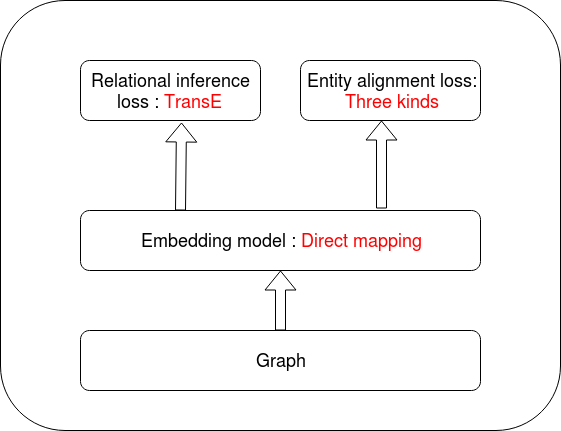
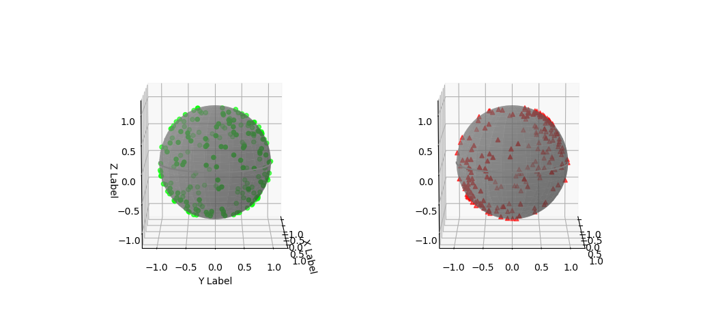
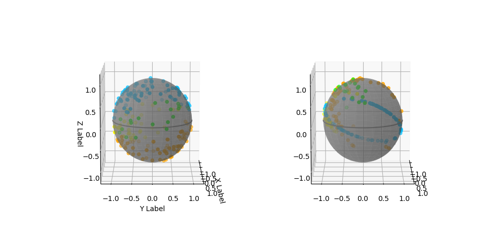

---
#### Entity Alignment in Knowledge Base
---
ZHAO XIN (2018-11-14)

---

### Catalog

- Motivation
- Tasks
- Related Works
- Experiment
- Analysis

---

### 1. Motivation

- 1.1 Cross-Graph relational inference

  - **Multi-source learning** is important for **relatonal inference**.
  - For example : **Heterogeneous knowledge graph** of (author, paper, keyword)

>>>

  
   
  <b>Authors-Publications-Keywords network</b>

>>>

- 1.2 Cross-lingual Knowledge Alignment

  - Cross-lingual knowledge is essential for **Cross-language AI-related applications**
  - For example : **Semantic Web**, **question answering** and **Machine translation**.

>>>

  
   
  <b>Multi-linguality gap : 
  Multilingual knowledge bases is unbalanced between languages.<b/>

>>>

- 1.3 Knowledge base Enhance

  - Use one knowledge base to **enhance** another one.
  - For example :
    Freebase <-> DBpedia
    <!-- - Freebase is a stop-updating database. But DBpedia is still updating.
    - Entity alignment dataset is exist
    - It is possible to use DBpedia to enhance freebase -->

>>>

  
  <b>Mapping between DBpedia and Freebase</b>

---

### 2. Task

- **Task Definition**
- Dataset Collection

---

### 2.1 Task Definition

- **Task Definition**
  - Condition : Two knowledge graphs with alignment entities
  - Goal : Find more alignment entities

>>>

 
<b>A example on FB15K<b/>  

>>>

##### 2.1.1 Dataset Definition

- Entity set:

  $$\mathcal{E}=\mathcal{E}_1\cup\mathcal{E}_2\cup\mathcal{E}_s$$

- Sub-graph1:

  $$\mathcal{G1} : \{(e_i^{h1},r_i^1,e_i^{t1})|e_i^{h1},e_i^{t1}\in\mathcal{E_1}\cup\mathcal{E}_s, r_i^1\in\mathcal{R_1}}$$

- Sub-graph2:

  $$\mathcal{G2} : \{(e_i^{h2},r_i^2,e_i^{t2})|e_i^{h2},e_i^{t2}\in\mathcal{E_2}\cup\mathcal{E}_s, r_i^2\in\mathcal{R_2}}$$

- Complete Graph:

  $$\mathcal{G} : \{(e_i^h,r_i,e_i^t)|e_i^h,e_i^t\in\mathcal{E}, r_i\in\mathcal{R}\}$$

>>>

Venn graph

  

>>>

##### 2.1.2 Problem Definition

- Train/Test Division:

  $$\mathcal{E}_1=\mathcal{E}_1^{train}\cup\mathcal{E}_1^{test}$$

  $$\mathcal{E}_2=\mathcal{E}_2^{train}\cup\mathcal{E}_2^{test}$$

  $$\mathcal{E}_s=\mathcal{E}_s^{train}\cup\mathcal{E}_s^{test}$$

>>>

- Problem setting

  - $\mathcal{E}_1^{train}, \mathcal{E}_2^{train}, \mathcal{E}_s^{train}$ And
    $\mathcal{E}_1^{test}\cup\mathcal{E}_s^{test},\mathcal{E}_2^{test}\cup\mathcal{E}_s^{test}$ is known
  - $\mathcal{G1}, \mathcal{G2}$ is known
  - $\mathcal{E}_1^{test}, \mathcal{E}_2^{test}, \mathcal{E}_s^{test}$ is unknown

- Task
  Identifying elements in $\mathcal{E}_1^{test}, \mathcal{E}_2^{test}, \mathcal{E}_s^{test}$

>>>

Venn graph

>>>

- Classification
  - Given two nodes belong to two graphs individually
  - Predict whether they are same or Not

- Notation Definition

  $$\theta = \arg\max_{\theta} P\big\((e_1^i, e_2^i, c^i)| \mathcal{G1}, \mathcal{G2}, \theta\big\)$$

  $$  c^i =
\begin{cases}
1,  & \text{if  $e_1^i=e_2^i$ and } e_1^i \in \mathcal{E}_1\cup\mathcal{E}_s, e_2^i \in \mathcal{E}_2\cup\mathcal{E}_s\\\\
0, & \text{else}
\end{cases}$$

---

### 2.2 Dataset Collection

- Dataset collection
  - Dummy dataset - FB15K 
  - **Real dataset**

>>>

##### 2.2.1 - Real dataset

- Three basic parts
  - FB15K 	(download available : 13583 entities 592213 triples)
  - DBpedia (crawl online : 12730 entities 112391 triples)
  - DBs-FBs -> download available

>>>

- After mapping
  - 15580 DB items
  - 13499 FB items (13583 in raw FB15K)

>>>

- Properties:
  - One-to-many mapping relation between two datasets
  - Each knowledge graph has many unique relations

---

### 3. Related Work

- Review task 
- Direct Alignment Models
- Embedding Models

---

#### 3.1 Review task

 
<b>A example on FB15K<b/>  

>>>

#### 3.2 Direct Alignment Models

- Factorization of adjacency matrices

- $\min_P||PAP^T-B||^2_F$

>>>

 
<b>Direct mapping of nodes<b/>

>>>

#### 3.3 Embedding Models

- Mapping from entities to embeddings
- Caculate loss function based on embeddings

>>>

 
<b>Model Overview<b/>

>>>

##### 1) Embedding models

- Directly mapping model
  - $\mathbb{e}_i =E \cdot e_i$

- Context-based embedding
  - Graph convolution embedding
  - Use of attribution information

>>>

##### 2) Loss function

- Loss function have two parts:
  - Relation inference loss
  - Entity alignment loss

>>>

 
<b>Model Overview<b/>

>>>

##### 3) Loss function - Relation inference loss

- Relation inference loss
    - Transition-based method
    - Matrix Factorization

>>>

 
<b>Transition-based method<b/>

>>>

 
<b>Matrix Factorization<b/>

>>>

##### 4) Loss function - Entity alignment loss

- Entity alignment loss
  - Translation-based Model
  - Parameter Sharing Model
  - Linear Transformation Model
    

>>>

 
<b>Parameter Sharing Model<b/>  
<b>- $\min\sum_k ||e_k^1+r^{(E_1\to E_2)}-e_k^2||$<b/>

>>>

 
<b>Parameter Sharing Model<b/>  
<b>$\min\sum_k ||e_k^1-e_k^2||$<b/>

>>>

 
<b>Linear Transformation Model<b/>  
<b>$\min\sum_k ||M^{(E_1\to E_2)}e_k^1-e_k^2||$<b/>

---

### 4. Experiment

- Related work (Entity Alignment)
- My experiments (Entity Alignment)
- Synthetic data experiment (New task)

---

##### 4.1 Related work

- JE(2016), MTransE(2017)
  - Embedding model : 
    - Direct mapping
  - Loss function :
    - Relational inference loss : TransE
    - Alignment loss : Three loss function above

>>>

 
<b>Overview of MTranE Model<b/>  

>>>

- **Result**:

|   |JE(hit@10)|MTranE(hit@10)|
|---|---|---|---|
|Translation Loss|0.865|0.903|
|Parameter sharing|0.864|0.923|
|Linear transition|0.781|0.922|

---

##### 4.2 My experiments

- Pipeline model
- Joint model

>>>

##### 4.2.1 Pipeline model

- Pipeline Model : TransE + Classification neural network
  - Idea : Mapping between two embedding spaces
  - Weakness : Incremental pipeline model - Increasing error

>>>

- Classification neural network
  - Non-concatenated
  - Concatenated

>>>

- Non-concatenated NN

  

>>>

- Concatenated NN

  
  
  
  
  
  
   
  <b>Forward &emsp;&emsp;&emsp;&emsp;&emsp;&emsp;&emsp;&emsp;&emsp;&emsp;&emsp;&emsp;Backward </b>

>>>

- Result - Concat VS Non-Concat

Overlap rate:0.5           Train rate:0.5

  

    
      
    
    
      
    
     
    <b>Non-concatenated&emsp;&emsp;&emsp;&emsp;&emsp;&emsp;&emsp;&emsp;Concatenated</b>
  

>>>

##### 4.2.2 Joint model

- One more experiment with Neural loss on FB15K data

>>>

 
<b>Neural Loss<b/>

>>>

- Result on Entity alignment task:

|||
|---|---|
|Joint Concat(F1)|0.466|
|Joint NonConcat(F1)|0.448|
|Pilpline Concat(F1)|0.911|
|Pilpline NonConcat(F1)|0.506|
|Translation Loss(hit@10)|0.865|
|Parameter sharing(hit@10)|0.864|
|Linear transition(hit@10)|0.781|

---

##### 4.3 Synthetic data

- What is Synthetic data? 
- Why collect Synthetic data?
- How to deal with synthetic data?

>>>

##### 4.3.1 What is Synthetic data?

- Three kinds of linear transition pairs:
  - Simple linear transition
  - Multi-linear transition by Mixture space 
  - Multi-linear transition by Sperated space

>>>

Simple linear transition

 
<b>$A \cdot T = B$<b/>  

>>>

Multi-linear transition by Mixture space

 
<b>$A_i \cdot T_i = B_i\ \ \ \forall i\in \\{1,2,3,4\\}$<b/>  

>>>

Multi-linear transition by Sperated space

 
<b>$A_i \cdot T_i = B_i,S(i)\bigcap S(j)=\emptyset$<b/> 
<b>$\forall i,j\in \\{1,2,3,4\\}$<b/> 

>>>

##### Variation of synthetic data - On sphere?

- All the embedding in TransE is on the sphere by normalization
- Do same thing to synthetic data

>>>

Simple linear transition on sphere

 
<b>$\mathbf{Norm}(A \cdot T) = B$<b/>  

>>>

Multi-linear transition by Mixture space on sphere

 
<b>$\mathbf{Norm}(A_i \cdot T_i = B_i)\ \ \ \forall i\in \\{1,2,3,4\\}$<b/>  

>>>

Multi-linear transition by Sperated space on sphere

 
<b>$\mathbf{Norm}(A_i \cdot T_i = B_i),S(i)\bigcap S(j)=\emptyset$<b/> 
<b>$\forall i,j\in \\{1,2,3,4\\}$<b/> 

>>>

##### 4.3.2 Why do this experiment

- To verify capacity of different model. 
- To speculate geometry properties of MTransE

>>>

##### 4.3.3 How to deal with synthetic data?

- Train on four loss function:
  - Translation-based Model (Trans)
  - Linear Transformation Model (LinearT)
  - Concatenation Neural network (Concat)
  - Non-concatenation Neural network (NonConcat)

- With six set of data:

>>>

**Results:**

|   |Trans(hit@10)|LinearT(hit@10)|Concat(F1)|NonConcat(F1)|
|---|---|---|---|---|
|LinearCube|0.359|1.000| 0.999 | 0.999 |
|LinearSphere| 0.001 |1.000| 1.000 | 1.000 |
|MultiMixCube|0.491|0.560| 0.998 | 0.993 |
|MultiMixSphere| 0.000 | 0.020 | 1.000 | 1.000 |
|MultiSperaCube| 0.485 | 0.575 | 0.990 | 0.998 |
|MultiSpereSphere| 0.000 | 0.016 | 1.000 | 1.000 |

---

### 5. Analysis

- Verify capacity of different models.
- Speculate geometry properties of MTransE

---

##### 5.1 Capacity

- Transition model:
  Unable to handle n-Dim linear transformation task

 
<b>Transition model<b/>

>>>

- Linear transformation model:
  - Able to handle n-Dim linear transformation task (1)
  - Unable to solve task of linear transformation with latent variable (2)

>>>

 
<b>Linear transformation model<b/>

>>>

- Neural model:
  - Able to solve task of linear transformation with latent variable (3)
  - Easy to overfit (4)

>>>

 
<b>(3)Latent linear transformation   (4)Easy to overfit<b/>

---

##### 5.2 Geometry properties

- Maybe linear?  : Even the transition model can perform well (1)
- Need strong inductive bias to conduct training of entity alignment model (2)

>>>

 
<b>(1)Maybe linear?  (2)Strong inductive bias<b/>

>>>

##### 5.3 A question ?

- A conflict :
  - Non-concat neural model can capture linear transformation even with latent variable
  - But why neural model can't solve entity alignment on pipeline model
  - And transition model can do it 

>>>

 
<b>A question ?<b/>

---

#### 6. Future work 

- Design experiment to solve the conflict